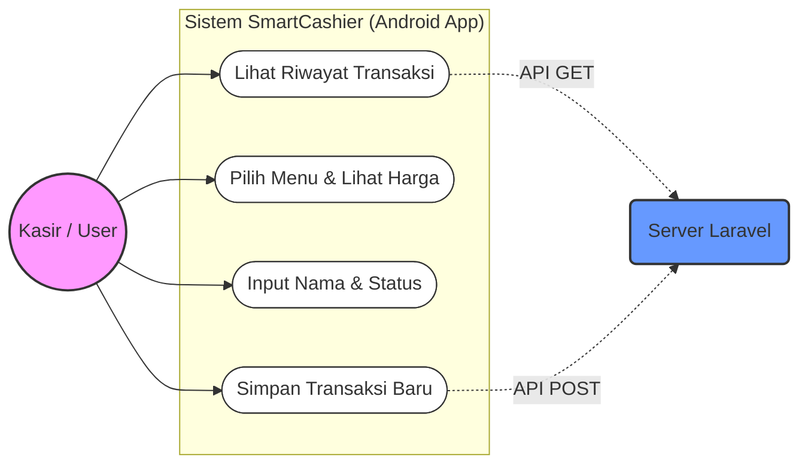
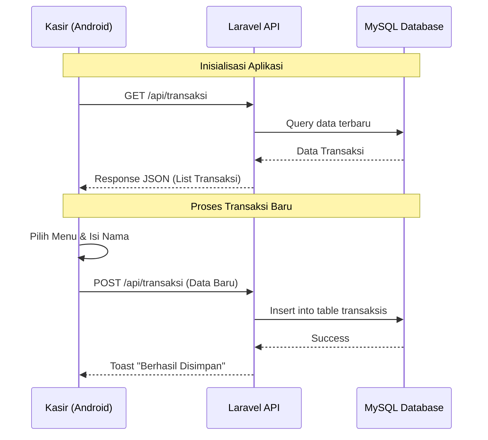

# SmartCashier: Integrated Web & Mobile Cashier System

**SmartCashier** adalah sistem manajemen kasir terintegrasi yang menggabungkan kekuatan **Laravel 11** sebagai sistem manajemen basis data (Backend/Admin) dan **Kotlin Native** sebagai aplikasi terminal transaksi (Frontend Mobile). Proyek ini dikembangkan sebagai bagian dari tugas akademik

---

## 🚀 Fitur Utama

### **Web Dashboard (Laravel)**
* **Manajemen Data Transaksi**: Melihat, menambah, dan mengelola data riwayat penjualan secara terpusat.
* **RESTful API Server**: Menyediakan endpoint JSON untuk komunikasi data dengan aplikasi mobile menggunakan Laravel.
* **Database Integration**: Menggunakan MySQL untuk penyimpanan data yang persisten dan aman.

### **Mobile App (Kotlin Native)**
* **Native Performance**: Dibangun menggunakan kodingan Kotlin murni untuk kecepatan dan responsivitas maksimal.
* **Real-time Data Sync**: Mengambil data transaksi dari server secara asinkron menggunakan library **Retrofit**.
* **Smart Selection (Spinner)**: Fitur *dropdown* menu dengan kalkulasi harga otomatis untuk meminimalisir kesalahan input manual.
* **POST Transaction**: Mengirim data pesanan baru langsung ke server Laravel melalui jaringan internet menggunakan metode POST.

---

## 🛠️ Tech Stack

| Komponen | Teknologi |
| :--- | :--- |
| **Backend** | Laravel 11 (PHP 8.x) |
| **Frontend Mobile** | Kotlin Native (Android SDK) |
| **Database** | MySQL / MariaDB |
| **API Client** | Retrofit 2 & GSON Converter |
| **Server** | Apache (XAMPP) |

---

## 📋 User Stories

User stories mendefinisikan kebutuhan sistem dari perspektif pengguna:

| Sebagai... | Saya ingin... | Agar... |
| :--- | :--- | :--- |
| **Kasir** | Melihat daftar transaksi terbaru secara real-time. | Saya bisa memantau pesanan yang masuk. |
| **Kasir** | Memilih menu makanan/minuman melalui daftar dropdown. | Input data lebih cepat dan tidak terjadi kesalahan penulisan menu. |
| **Kasir** | Harga barang muncul secara otomatis setelah memilih menu. | Saya tidak perlu menghafal harga atau salah memasukkan nominal. |
| **Kasir** | Menyimpan transaksi langsung ke server melalui aplikasi HP. | Data tersentralisasi dan bisa diakses oleh admin web di mana saja. |

---

## 🛠️ Software Requirements Specification (SRS)

### **1. Functional Requirements**
* **FR-01**: Sistem harus mampu menampilkan daftar transaksi dari database melalui API GET.
* **FR-02**: Sistem harus menyediakan antarmuka dropdown (Spinner) untuk pemilihan menu barang.
* **FR-03**: Sistem harus mengisi field harga secara otomatis berdasarkan logika mapping di aplikasi Android.
* **FR-04**: Sistem harus mampu mengirimkan data transaksi baru ke server melalui API POST.
* **FR-05**: Dashboard web harus mampu mengelola data (CRUD) yang dikirimkan dari perangkat mobile.

---

## 📊 Arsitektur Sistem

Sistem ini menggunakan arsitektur **Client-Server** berbasis **REST API**. 

### **Use Case Diagram**

### **Activity Diagram**

